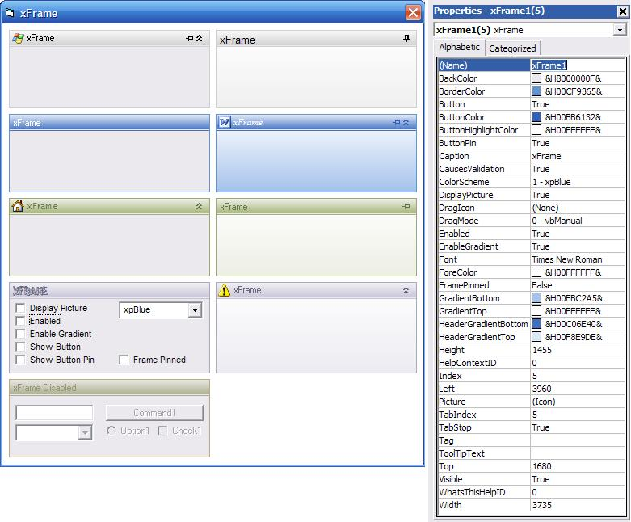



## xFrame Usercontrol

### Description

***UPDATE 11/05/2007*** Fixed issue with retrieving the expanded event at runtime

***PREVIOUS UPDATES*** Fixed the flicker issue with both the Frame text and Frame icon, Added Expanded Event, Added Click, DblClick, MouseDown, MouseMove and MouseUp Events, Added Frame Pin Button and Pinned event as per request from kibe, Fixed a small issue with repaint refreshing the entire screen, Changed some code thanks to Roger Gilchrist, Create required controls using code, Font support and Picture ability added, fixed issue with Gradient Let code.

This is an owner drawn frame that comes with 4 preset colour schemes... xpDefault, xpBlue, xpOliveGreen and xpSilver.

The frames have a gradient colour used for their headers and their main body. This also has a button that allows the frame to be used to hold controls and be minimised at runtime.

All of the colours can be changed with different colours/gradients created at design time.

This was made in a few hours today so I have not thoroughly tested it. Any problems please let me know, or any advice to make this better or maybe even add new styles let me know.

The UserControl was written by myself and the module used for gradient colours was written by Mark Gordon, which I found on another site.

Hope this is useful to someone... don't forget to vote if you like this xFrame.
 
### More Info
 

             |
---                |---
**Submitted On**   |2007-05-10 20:17:26
**By**             |[Xander75](https://github.com/Planet-Source-Code/PSCIndex/blob/master/ByAuthor/xander75.md)
**Level**          |Intermediate
**User Rating**    |4.7 (147 globes from 31 users)
**Compatibility**  |VB 6\.0
**Category**       |[Custom Controls/ Forms/  Menus](https://github.com/Planet-Source-Code/PSCIndex/blob/master/ByCategory/custom-controls-forms-menus__1-4.md)
**World**          |[Visual Basic](https://github.com/Planet-Source-Code/PSCIndex/blob/master/ByWorld/visual-basic.md)
**Archive File**   |[xFrame\_Use2065195112007\.zip](https://github.com/Planet-Source-Code/xander75-xframe-usercontrol__1-68342/archive/master.zip)

